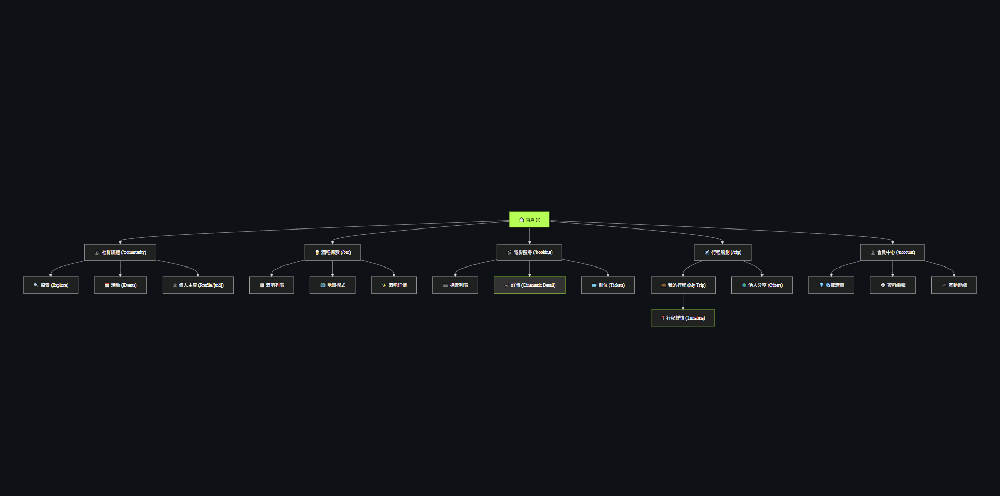

# 🍹 Taipei Date — 全端社交約會平台

> 獨立開發的全端專案，涵蓋身份驗證、雲端儲存、社群互動與行程規劃。  
> 從資料庫設計、API 架構到正式雲端部署，完整走完一個產品的開發生命週期。

👉 **線上 Demo**：[taipei-date.vercel.app](https://taipei-date.vercel.app)  
🔑 測試帳號：`test@gmail.com` / `aA!123456`

---

## 🏗️ 系統架構

| 層級 | 技術 | 說明 |
| :--- | :--- | :--- |
| 前端 | Next.js 14, Tailwind CSS | App Router，部署於 Vercel |
| 後端 | Node.js, Express, Prisma | RESTful API，部署於 Render |
| 資料庫 | MySQL | 雲端託管於 Aiven |
| 雲端儲存 | AWS S3 | 使用者圖片與大頭照 |
| 身份驗證 | JWT + Firebase Google OAuth | 雙軌登入機制 |
| 信件服務 | Nodemailer + Gmail API | OTP 驗證信寄送 |

---

## ⚙️ 核心技術實作

### 1. 身份驗證系統
- **雙軌登入**：標準帳密登入（JWT）+ Google OAuth 一鍵登入（Firebase）
- **OTP 註冊驗證**：透過 Gmail API 寄送驗證碼，含時效控制與重送限制
- **JWT Session 管理**：無狀態 Token 驗證，保護所有需授權的 API

### 2. 雲端圖片上傳
- 使用 **AWS SDK** 處理圖片上傳至 S3 Bucket
- 前端直接拿到 S3 URL，不經過後端伺服器傳輸，減少頻寬消耗

### 3. 統一 API 回應封裝
- 自定義 API 客戶端，統一回應格式（`success`, `message`, `data`）
- 讓前端組件直接使用資料，減少重複的錯誤判斷邏輯

### 4. 服務層架構（Service Layer）
- API 呼叫與 UI 完全解耦
- React 組件只負責渲染，業務邏輯集中於 Service 層，便於維護與擴展

---

## 🛠️ 功能總覽

### 會員系統
- 註冊 / 登入 / 忘記密碼（OTP 驗證）
- Google 第三方登入
- 會員資料編輯、興趣標籤選擇
- 大頭照上傳（AWS S3）
- 每日登入點數獎勵

### 社群媒體
- 仿 Instagram 社群貼文瀏覽
- 追蹤 / 被追蹤機制
- 貼文按讚與收藏

### 行程規劃
- 互動式日曆介面
- 自訂約會行程，加入酒吧與電影活動

### 酒吧 & 電影探索
- 台北酒吧列表與收藏
- 電影列表與收藏

---

## 🗺️ 站點地圖



---

## 📂 專案結構

```text
├── components/      # 可重用 UI 元件
├── context/         # React Context 全域狀態
├── hooks/           # 自定義 React Hooks
├── pages/           # Next.js 頁面路由
├── services/        # API 服務層
└── styles/          # 樣式設定
```

---

## 🚀 本地啟動

```bash
git clone https://github.com/john123881/ReactJS-DatingPlatform.git
npm install
```

建立 `.env.local`：
```env
NEXT_PUBLIC_FIREBASE_CONFIG=your_config
NEXT_PUBLIC_API_URL=http://localhost:3001
```

```bash
npm run dev
```

---

## 🎮 彩蛋

內建貪吃蛇小遊戲（React Hooks 實作），每日遊玩可獲得點數獎勵。

---

## 👤 作者

**John** · [a123881@gmail.com](mailto:a123881@gmail.com) · [@john123881](https://github.com/john123881)