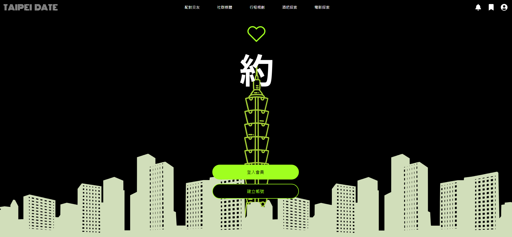
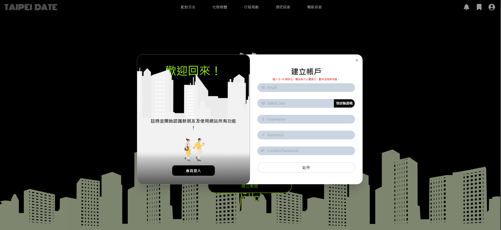
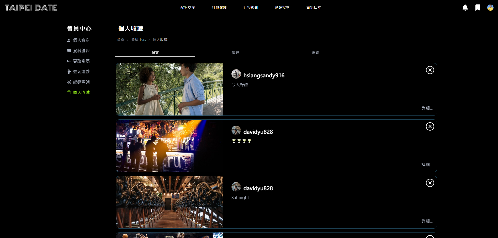

# Dating Platform for Final Project

Click to [DEMO](http://119.14.29.65:3000/) 
Account For Test :  
>Email: test@gmail.com 
>Password: aA!123456 

## 📋 Description

This Repo is a course exercise topic. (iSpan front-end engineer development course, final topic.)

The topic is Date in Taipei, which focuses on matching and making friends, using the same interests in bars and movies to find new friends, while social software and itinerary planning are supplemented to arrange date itineraries.

The functions I am responsible for include: member login/registration, password forget, member profile, game (Snake), and favorites center.

The front-end uses Next.js to build the website, the back-end uses Express.js to create the API, and the database uses MySQL. The above technologies are used to complete a website platform.

## 🔍 Function

Member login/registration

- One-click toggle animation for login/registration
- Google login (using Firebase Auth)
- Login authentication mechanism using JWT
- OTP verification email sent during registration (using Gmail API)
- Earn points for daily login

Password Forget

- Send OTP verification email for identity verification

Member Profile

- Modify member information/photos, select interests, record searches
- Upload images to be stored in an AWS S3 bucket
  
Game

- Earn points for daily gameplay

Favorites Center

- Retrieve recent posts, bars, and movie favorites!

## 🛠️ Technologies & Requirements

Front-end

- React.js
- Next.js
- Tailwind CSS

Back-end

- Node.js
- Express.js
- CORS
- Jsonwebtoken
- MySQL

## 💻 Demo Screenshot

 

  
  

 

  
  

 

 

 

  
  

 

 

 

## 👤 Author

Email:a123881@gmail.com

## ⭕️ Warning

The pictures used are purely for practice and homework purposes and have no commercial purpose or profit-making effect.Thanks!

